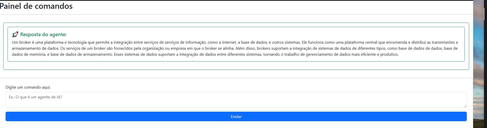

# Projeto 02 - Agente IA com Spring Boot

## 📋 Visão Geral

Sistema web que integra uma **IA (Flask)** com **Spring Boot** para processar tarefas assincronamente. O usuário envia perguntas através de uma página web e recebe respostas em tempo real usando Server-Sent Events (SSE).

---

## 🏗️ Arquitetura

```
Usuário (Navegador)
    ↓
Spring Boot (Controlador Web)
    ↓
Kafka (Fila de Mensagens)
    ↓
Flask (Servidor de IA)
    ↓
Kafka (Resposta)
    ↓
Spring Boot (SSE)
    ↓
Navegador (Atualização em tempo real)
```

---

## 🔧 Componentes Principais

### 1. **AiTaskController** (Controlador)
- **Função**: Recebe requisições HTTP do usuário
- **Endpoints**:
  - `GET /agent` → Carrega página do agente
  - `POST /agent/ask` → Envia pergunta para processamento
  - `POST /agent/resposta` → Recebe resposta da IA

### 2. **AiTaskService** (Serviço)
- **Função**: Gerencia a lógica de negócio
- **Operações principais**:
  - `sendTaskToAi()` → Envia pergunta via Kafka para Flask
  - `listenAiResults()` → Escuta respostas do Kafka e as processa
  - `saveTask()` → Armazena tarefas no banco de dados

### 3. **SseController** (Server-Sent Events)
- **Função**: Envia respostas em tempo real para o navegador
- **Como funciona**:
  - Mantém lista de conexões ativas dos clientes
  - Envia eventos quando novas respostas chegam
  - Remove conexões encerradas automaticamente

### 4. **AiTask** (Modelo)
- **Campos**: `prompt` (pergunta), `resposta` (resposta da IA)
- **Armazenamento**: Salvo no banco de dados

---

## 🔄 Fluxo de Funcionamento

1. **Usuário envia pergunta** (`POST /agent/ask`)
   - Exemplo: "Qual é a capital do Brasil?"

2. **Spring envia para Kafka** (tópico: `task`)
   - A pergunta é convertida em JSON

3. **Flask recebe e processa** (ouve o tópico `task`)
   - Gera resposta usando IA

4. **Flask envia resposta** (tópico: `task-results`)
   - Resposta em JSON com o campo `resposta`

5. **Spring recebe via Kafka** (`listenAiResults()`)
   - Extrai a resposta do JSON
   - Formata em HTML com estilo

6. **Envia para navegador via SSE** (`sseController.dispararTela()`)
   - Todos os navegadores conectados recebem a resposta
   - Atualização em tempo real, sem recarregar página

7. **Salva no banco de dados**
   - Histórico de tarefas e respostas

---

## 📦 Tecnologias Utilizadas

| Tecnologia | Uso |
|-----------|-----|
| **Spring Boot** | Framework backend Java |
| **Kafka** | Mensageria assíncrona |
| **SSE** | Comunicação em tempo real |
| **Flask** | Servidor IA (Python) |
| **Banco de Dados** | Persistência de tarefas |
| **HTML/CSS** | Interface web |

---

## 🚀 Como Funciona o Fluxo em Tempo Real (SSE)

1. Ao abrir a página `/agent`, o navegador estabelece conexão SSE
2. Quando a IA responde, `dispararTela()` envia para **todos os navegadores** conectados
3. A página atualiza **sem recarregar**, mostrando resposta em card formatado

---

## 💾 Tratamento de Erros

- Conexão SSE encerrada? → Remove emitter automaticamente
- Timeout da conexão? → Remove da lista de emitters
- Erro no Kafka? → Captura e log de erro

---

## 📝 Resumo do Fluxo

```
Web Form → Controller → Kafka → IA (Flask) → Kafka → Service → SSE → Navegador
                                                        ↓
                                                  Banco de Dados
```

---

## 🎯 Conclusão

Sistema integrado que conecta interface web, processamento assíncrono via Kafka e IA em tempo real, oferecendo experiência fluida e responsiva ao usuário.
